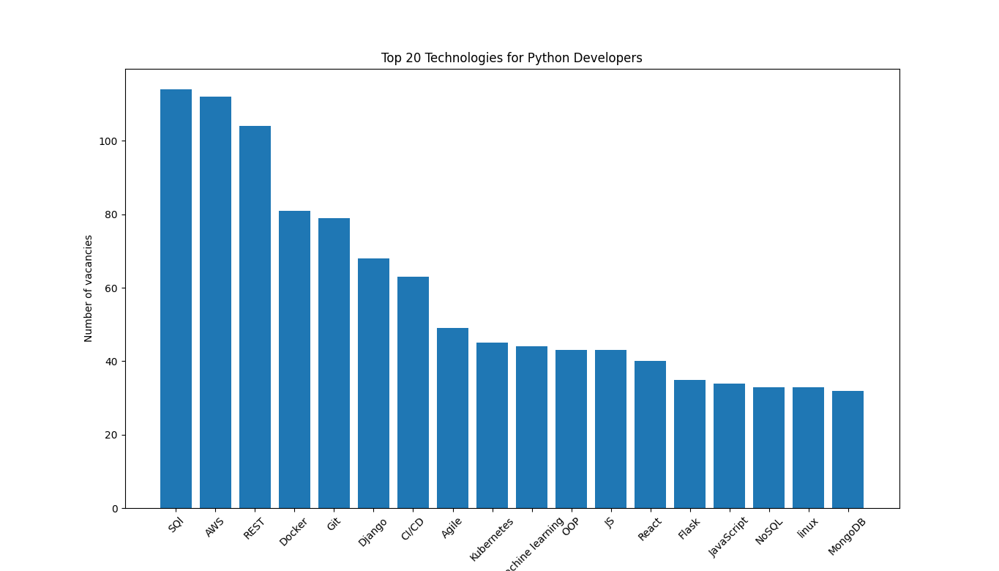
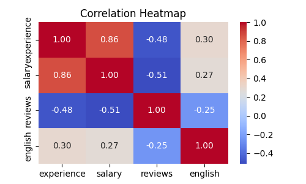

# Web Scraping and Data Analysis
This project aims to provide insights into the most demanded technologies for Python Developers in the job market. By scraping job listings from Djinni and analyzing the technologies mentioned in the descriptions, we can generate statistics on the popularity of various technologies.

## Installing
   ```bash
   git clone https://github.com/VasylTurok/web-scraping-and-data-analysis.git
   cd web-scraping-and-data-analysis
   python -m venv venv
   source venv/bin/activate # or venv\Scripts\activate in Windows
   pip install -r requirements.txt
   ```
And run main.py file

### Diagram of the 20 most popular technologies for Python developers



### Correlation
